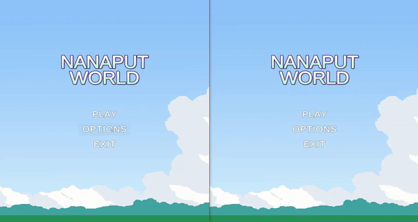

# Nanaput World - Multiplayer Game

## About the project
Welcome! 😁
This is a 2D multiplayer combat game. Up to 4 players can select their character and fight in an arena until the last one is standing.

    

The objective of this project was to explore game development, and acquire experience working with a server. Moreover, we aimed to create a fun game that reminisces the superpowers we imagined we had when playing as kids 💪🦹 (in fact, the background of the game was inspired by our childhood playground).

As there are improvements to be made to the game, the project is still in development. 

## Built using:
* C# programming language
* Unity Engine
* Photon Engine's PUN 2 (for the server)
* Photoshop (for the sprites)

## Creators:

| Name           | Github   |
| -------------- | ---------|
| Steven Kim     | zteben   |
| Parsa Langari  | PLangari |
